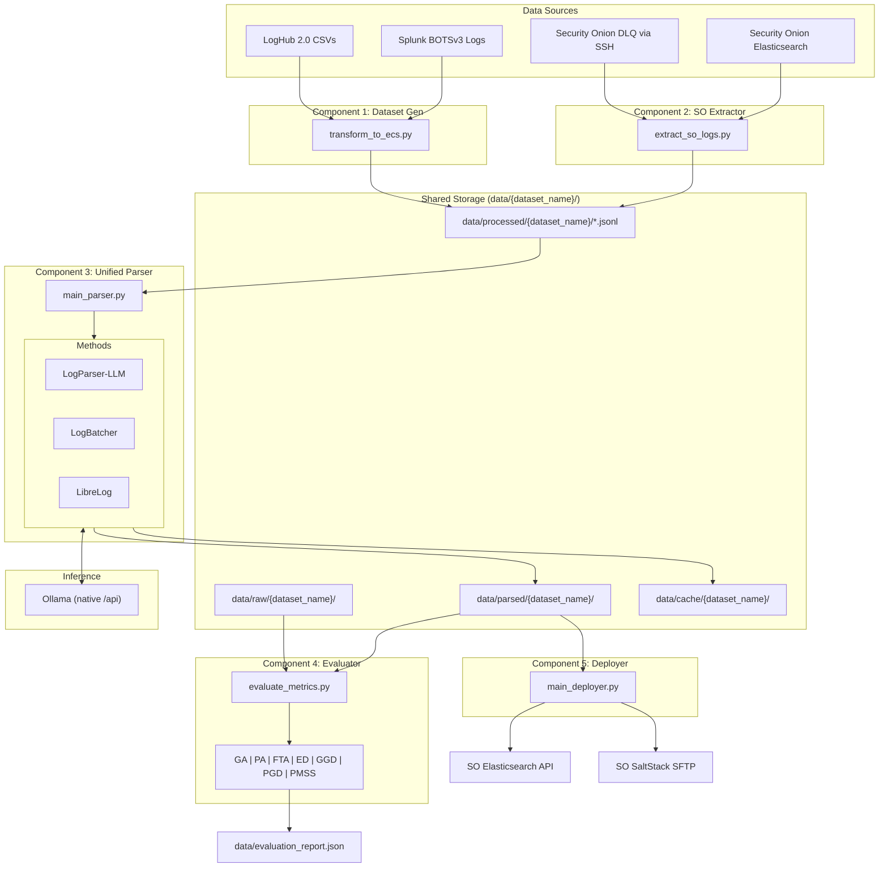

# Log Parser Pipeline

An advanced, containerized data-engineering pipeline for log ingestion, standardization, LLM-based template parsing, and automated evaluation against ground truth.

---

## 1. System Architecture



---

## 2. Directory Layout

```
log-parser-pipeline/
├── component_1_dataset_gen/          # ECS standardization
│   ├── Dockerfile
│   ├── requirements.txt
│   └── transform_to_ecs.py
├── component_2_so_extractor/         # Security Onion extraction
│   ├── Dockerfile
│   ├── requirements.txt
│   └── extract_so_logs.py
├── component_3_unified_parser/       # LLM-based parsing engine
│   ├── core/
│   │   ├── llm_client.py             # Ollama API client (native /api + /v1 compat)
│   │   ├── logparser_llm/            # Prefix tree, ICL, tree router
│   │   ├── logbatcher/               # DBSCAN clustering, DPP sampling
│   │   └── librelog/                 # Drain grouping, regex manager, reflection
│   ├── Dockerfile
│   ├── requirements.txt
│   └── main_parser.py
├── component_4_evaluator/            # Metrics evaluation suite
│   ├── metrics/
│   │   ├── GA_calculator.py          # Grouping Accuracy
│   │   ├── PA_calculator.py          # Parsing Accuracy
│   │   ├── FTA_calculator.py         # Few-shot Template Accuracy
│   │   ├── ED_calculator.py          # Edit Distance (Levenshtein)
│   │   ├── GD_calculator.py          # GGD & PGD calculators
│   │   ├── PMSS_calculator.py        # Precomputed Silhouette Score
│   │   └── oracle_correction.py      # Whitespace/sensitivity normalizer
│   ├── Dockerfile
│   ├── requirements.txt
│   └── evaluate_metrics.py
├── component_5_deployer/             # Grok ingest deployer
│   ├── core/
│   │   ├── compiler.py               # Grok pattern compiler
│   │   ├── validator.py              # Ingest pipeline simulator
│   │   ├── es_client.py              # Elasticsearch API client
│   │   └── salt_sftp.py              # SaltStack SFTP deployer
│   ├── Dockerfile
│   ├── requirements.txt
│   └── main_deployer.py
├── tests/                            # Unit & integration tests
│   ├── mock_ollama/                  # Mock LLM server for E2E tests
│   ├── test_component_*.py
│   └── test_logparser_llm_enhancements.py
├── data/
│   ├── raw/{dataset_name}/           # Ground truth CSVs
│   ├── processed/{dataset_name}/     # Standardized ECS JSONL
│   ├── parsed/{dataset_name}/        # Parser output + profiles
│   ├── cache/{dataset_name}/         # Template caches
│   └── archive/{dataset_name}/       # Historical evaluation reports
├── config.yaml                       # Central pipeline configuration
├── .env                              # Runtime environment variables
├── docker-compose.yml                # Dev/production compose
├── docker-compose.test.yml           # E2E integration test compose
├── run_e2e.sh                        # E2E test runner script
└── pytest.ini
```

---

## 3. Components

### Component 1: Dataset Ingestion & ECS Standardization
Converts heterogeneous log datasets into uniform ECS-formatted JSON Lines files. Reads `dataset_name` from `config.yaml` to automatically resolve input/output directories.

| Source | Mapping |
|---|---|
| **LogHub 2.0** | `Date`+`Time` → `@timestamp`, `Content` → `message`, `Level` → `log.level`, `Component` → `log.logger`, `LineId` → `event.id` (prefixed with dataset name) |
| **Splunk BOTSv3** | `_time` → `@timestamp`, `_raw` → `message`, `sourcetype` → `event.dataset`, `host` → `host.name` |

When multiple source CSVs are present (e.g. 14 LogHub datasets), logs are shuffled per-dataset and interleaved round-robin to simulate realistic mixed-source ingestion.

### Component 2: Security Onion Extractor
Extracts logs from live Security Onion deployments:
- **DLQ Extraction**: SSH via Paramiko over Tailscale to stream dead letter queue files.
- **Unmapped Logs**: Elasticsearch Scroll API queries for logs missing `event.category`.

### Component 3: Unified Parser
Routes ECS logs through one of three parsing methods (selected via `--method` flag):

| Method | Architecture | Key Features |
|---|---|---|
| **LogParser-LLM** | Sequential prefix tree router | Strict/loose matching with configurable similarity metrics (`positional_uniform`, `positional_decay`, `jaccard`), adaptive few-shot ICL via embedding similarity, variable-aware prompting with 10 token categories, LRU tree pruning |
| **LogBatcher** | Batch clustering + DPP sampling | DBSCAN with precomputed Jaccard distances, DPP diversity sampling for representative batch queries, `OrderedDict` LRU cache, 3-tier noise fallback (cache → re-queue → regex mask) |
| **LibreLog** | Drain grouping + reflection | Drain prefix tree pre-grouping, O(1) `DummyMemory` cache + O(log N) `RegexManager`, LLM reflection loops for self-correction, auto-conversion of regex to `<*>` templates |

### Component 4: Metric Evaluation
Computes seven accuracy metrics against ground truth:

| Metric | Description |
|---|---|
| **GA** (Grouping Accuracy) | Whether parsed clusters partition logs identically to ground truth |
| **PA** (Parsing Accuracy) | Token-level accuracy of variable masking |
| **FTA** (Few-shot Template Accuracy) | Proportion of correctly extracted unique templates |
| **ED/NED** (Edit Distance) | Average Levenshtein distance between parsed and oracle templates |
| **GGD** (Group Granularity Distance) | `\|N_generated - N_oracle\| / N_oracle` |
| **PGD** (Parsing Granularity Distance) | Mean token-length distance between generated and modal oracle templates |
| **PMSS** (Precomputed Silhouette Score) | Silhouette score on unique templates, broadcast to full log length — reduces complexity from O(N²) to O(M²) |

**LogHub split evaluation**: When `dataset_name: "loghub"`, the evaluator automatically segments results by sub-dataset (Apache, BGL, HDFS, etc.) using the `LineId` prefix, reporting per-dataset and overall metrics.

### Component 5: Grok Ingest Deployer
Compiles parsed templates into Elasticsearch Grok ingest pipelines and deploys them:
- Translates `<*>` placeholders into Grok expressions with proper escaping.
- Pre-flight simulation via `/_ingest/pipeline/_simulate`.
- Two-pronged deployment: Elasticsearch PUT API (immediate) + SFTP to SaltStack (persistent).
- Idempotent: skips redundant redeployments.

---

## 4. Configuration

### `config.yaml`
Central pipeline configuration. Key sections:

```yaml
directories:
  dataset_name: "loghub"        # Options: "loghub", "botsv3", "custom"
  input_dir: data/raw            # Base raw data directory
  output_dir: data/processed     # Base processed output directory
  cache_dir: data/cache          # Base cache directory

logparser_llm:
  icl_selection_strategy: "similarity"    # "similarity" or "diversity"
  loose_match_metric: "positional_uniform" # "positional_uniform", "positional_decay", "jaccard"
  categories_mode: "paper_10"             # "ecs_10", "paper_10", "ecs_3"

logbatcher:
  sampler: "DPPSampler"         # "DPPSampler" or "SimilarSampler"
  vectorizer: "binary"          # "binary" (Jaccard) or "tfidf" (Cosine)

evaluator:
  nrows: 50000                  # Row limit per ground truth file (null for all)
```

All directory paths are dynamically resolved as `{base_dir}/{dataset_name}/`, so switching datasets requires only changing `dataset_name`.

### `.env`
Runtime environment variables consumed by Docker Compose:

| Variable | Default | Description |
|---|---|---|
| `OLLAMA_API_BASE` | `http://ollama:11434/api` | Ollama endpoint (use `/api` for native, `/v1` for OpenAI-compat) |
| `OLLAMA_MODEL` | `qwen` | Model name passed to Ollama |
| `OLLAMA_TIMEOUT` | `90` | Request timeout in seconds |
| `USE_CACHE` | `false` | Load existing template cache on startup |
| `WRITE_CACHE` | `true` | Save discovered templates to cache on exit |
| `LLM_DEBUG` | `false` | Log raw LLM request/response payloads to `llm_debug.jsonl` |

> [!IMPORTANT]
> Use the native `/api` endpoint (not `/v1`) to enable `"think": false` for reasoning models (Qwen, DeepSeek, Gemma). The `/v1` OpenAI-compat layer does not support this parameter, causing reasoning models to exhaust their token budget on thinking tokens before producing output.

### Docker Compose

All components run via Docker Compose with host user mapping (`user: "${UID}:${GID}"`) to prevent root-owned output files.

```bash
# Run the dataset generator
docker compose run --rm component_1

# Run the parser (25s test with cache write)
docker compose run --rm component_3 python main_parser.py --method logparser-llm --time-limit 25 --write-cache

# Run the evaluator
docker compose run --rm component_4 python evaluate_metrics.py

# Switch models dynamically
docker compose run --rm -e OLLAMA_MODEL=gemma4:27b component_3 python main_parser.py --method logparser-llm
```

---

## 5. Testing

### E2E Integration Test (`run_e2e.sh`)
1. Writes a mock `dummy_loghub.csv` with ground truth templates.
2. Starts `docker-compose.test.yml` which spins up a `mock_ollama` container.
3. Runs Components 1 → 3 → 4 in sequence.
4. Asserts `data/evaluation_report.json` is generated successfully.

```bash
./run_e2e.sh
```

### Unit Tests
```bash
pytest tests/
```

### GitHub Actions CI
On every push/PR to `main`: installs dependencies, runs `pytest tests/`, then runs `./run_e2e.sh`.

---

## 6. Production Security Notes

> [!WARNING]
> Review before exposing pipeline services to production.

| Issue | Risk | Mitigation |
|---|---|---|
| **SSL bypass** (`verify=False`) | Credentials exposed to network sniffing | Mount SO Root CA, set `verify='/app/certs/ca.crt'` |
| **Auto-trust SSH keys** (`AutoAddPolicy`) | DNS spoofing / session hijacking | Pre-populate `known_hosts`, use `RejectPolicy()` |
| **Root containers** | Container breakout → host root access | Add `USER appuser` directive in Dockerfiles |
| **Permissive port bindings** | Services exposed on all interfaces | Bind to `127.0.0.1` only |
| **Broad volume mounts** | Cross-container write escalation | Mount input dirs as read-only (`:ro`) |
