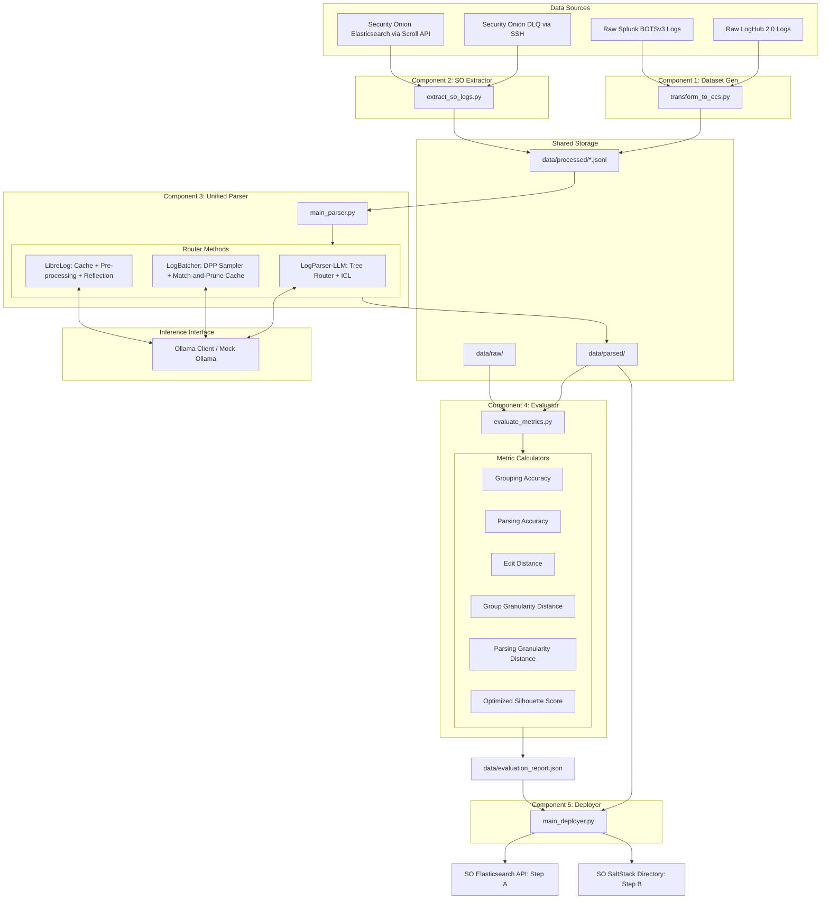

# Log Parser Pipeline

An advanced, containerized data-engineering pipeline for log ingestion, standardization, extraction, LLM-based template parsing, and automated mathematical evaluation.

---

## 1. System Overview & Architecture

This pipeline processes raw security log datasets, transforms them into standardized schemas matching the **Elastic Common Schema (ECS)**, extracts active dead-letter-queue (DLQ) and unmapped logs directly from a **Security Onion** deployment, routes those logs through advanced large language model (LLM) parser routers, and evaluates the parsing accuracy against ground truth using standard and custom metrics.

### System Architecture Flow



---

## 2. Directory Layout & Repository Topology

The repository follows a modular, component-based layout. Each component is fully containerized with its own `Dockerfile` and dependency requirements.

- **[log-parser-pipeline/](.)**
  - **[.github/workflows/ci.yml](.github/workflows/ci.yml)**: GitHub Actions CI/CD workflow configuration.
  - **[component_1_dataset_gen/](component_1_dataset_gen)**: Component 1 (Dataset Ingestion & ECS translation).
    - [Dockerfile](component_1_dataset_gen/Dockerfile)
    - [requirements.txt](component_1_dataset_gen/requirements.txt)
    - [transform_to_ecs.py](component_1_dataset_gen/transform_to_ecs.py): Ingestion and standardization entrypoint.
  - **[component_2_so_extractor/](component_2_so_extractor)**: Component 2 (Security Onion Extractor).
    - [Dockerfile](component_2_so_extractor/Dockerfile)
    - [requirements.txt](component_2_so_extractor/requirements.txt)
    - [extract_so_logs.py](component_2_so_extractor/extract_so_logs.py): DLQ and Elasticsearch Scroll extraction script.
  - **[component_3_unified_parser/](component_3_unified_parser)**: Component 3 (Unified Router Parser).
    - `core/`: Sub-modules containing LLM, prefix trees, length clusters, samplers, and matching logic.
      - [llm_client.py](component_3_unified_parser/core/llm_client.py): Robust Ollama API helper class.
    - [Dockerfile](component_3_unified_parser/Dockerfile)
    - [requirements.txt](component_3_unified_parser/requirements.txt)
    - [main_parser.py](component_3_unified_parser/main_parser.py): Router engine entrypoint.
  - **[component_4_evaluator/](component_4_evaluator)**: Component 4 (Metrics evaluation suite).
    - `metrics/`: Math calculator libraries.
      - [ED_calculator.py](component_4_evaluator/metrics/ED_calculator.py): Levenshtein distance metrics.
      - [GA_calculator.py](component_4_evaluator/metrics/GA_calculator.py): Grouping accuracy calculator.
      - [GD_calculator.py](component_4_evaluator/metrics/GD_calculator.py): GGD & PGD calculators.
      - [oracle_correction.py](component_4_evaluator/metrics/oracle_correction.py): Oracle whitespace alignment normalizer.
      - [PA_calculator.py](component_4_evaluator/metrics/PA_calculator.py): Token parsing accuracy calculator.
      - [PMSS_calculator.py](component_4_evaluator/metrics/PMSS_calculator.py): Precomputed silhouette metric scorer.
    - [Dockerfile](component_4_evaluator/Dockerfile)
    - [requirements.txt](component_4_evaluator/requirements.txt)
    - [evaluate_metrics.py](component_4_evaluator/evaluate_metrics.py): Evaluator orchestrator main script.
  - **[component_5_deployer/](component_5_deployer)**: Component 5 (Grok Ingest Deployer).
    - `core/`: Ingest compilation, validation, and SFTP transmission helper scripts.
      - [compiler.py](component_5_deployer/core/compiler.py): Grok pattern compiler.
      - [validator.py](component_5_deployer/core/validator.py): Elasticsearch simulation validator.
      - [es_client.py](component_5_deployer/core/es_client.py): Elasticsearch Ingest API client.
      - [salt_sftp.py](component_5_deployer/core/salt_sftp.py): SaltStack Paramiko SFTP deployer.
    - [Dockerfile](component_5_deployer/Dockerfile)
    - [requirements.txt](component_5_deployer/requirements.txt)
    - [main_deployer.py](component_5_deployer/main_deployer.py): Deployer orchestrator script.
  - **[tests/](tests)**: Pipeline testing suites.
    - `mock_ollama/`: Independent mock server configuration.
    - [test_component_1.py](tests/test_component_1.py): Unit tests for Component 1.
    - [test_component_2.py](tests/test_component_2.py): SSH and scroll mocked network tests.
    - [test_component_3_client.py](tests/test_component_3_client.py): Completion/embedding unit tests.
    - [test_component_4.py](tests/test_component_4.py): Metric mathematical accuracy checks.
  - **[config.yaml](config.yaml)**: Central configuration parameters.
  - **[docker-compose.yml](docker-compose.yml)**: Dev and production orchestration compose file.
  - **[docker-compose.test.yml](docker-compose.test.yml)**: Automated E2E integration test compose file.
  - **[pytest.ini](pytest.ini)**: Local system path mapping config.
  - **[run_e2e.sh](run_e2e.sh)**: End-to-end local container validation entrypoint.

---

## 3. Component Deep-Dives

### Component 1: Ingestion & ECS Standardization
Converts heterogeneous datasets into a uniform JSON Lines format matching the **Elastic Common Schema (ECS)**.
- **LogHub-2.0**: Extracts `Date` and `Time` columns into `@timestamp`, `Content` into `message`, `Level` into `log.level`, `Component` into `log.logger`, and `LineId` into `event.id`.
- **Splunk BOTSv3**: Extracts `_time` into `@timestamp`, `_raw` into `message`, `sourcetype` into `event.dataset`, and `host` into `host.name`.

### Component 2: Security Onion Extractor
Performs sequential log extraction from active Security Onion deployments:
- **Task A (Dead Letter Queue)**: Uses a secure `paramiko` SSH connection over a Tailscale device node to stream and write raw outputs from `/nsm/logstash/dead_letter_queue/main/*` to `so_dlq_logs.jsonl`.
- **Task B (Unmapped Logs)**: Initiates an Elasticsearch `_search?scroll=2m` API query over HTTPS targeting logs where `_exists_:message AND NOT _exists_:event.category` while excluding noisy performance monitoring categories. Iterates through the scroll loop to extract the raw `_source` properties.

### Component 3: The Unified Parser Router
Routes standard ECS logs to one of three state-of-the-art parsing configurations:
- **LogParser-LLM**: Implements an in-memory prefix tree (`PrefixTree`) strict/loose router. Features **Adaptive Few-Shot ICL** via dynamic local Jaccard similarity lookups, structured **JSON/ECS field mapping** for automatic ingestion classifications (such as mapping IP/File fields), and recursive **Prefix Tree LRU Pruning** of nodes older than 30 days to protect memory usage.
- **LogBatcher**: Executes zero-shot diverse parsing. Integrates **DBSCAN Clustering** utilizing precomputed Jaccard distances for order-independent grouping. Samples diverse templates using a **DPP Sampler** on log cosine embeddings, caches templates via an `OrderedDict`-backed cache with **LRU Eviction**. Outlier logs (noise) are handled via a **3-Tier Fallback** (cache match → micro-batch re-queue → regex pre-masking) to prevent template explosion without incurring LLM cost.
- **LibreLog**: Implements static regex preprocessing, executes an initial **Drain Prefix Tree Grouping Pass** for log clustering, queries a high-performance O(1) `DummyMemory` cache alongside a dynamic O(log N) `RegexManager`, and parses fallback logs using an Ollama LLM parser augmented with reflection loops. Features a custom **O(N) index-free filtering optimization** for fast processing and auto-conversion of regex patterns to standard `<*>` templates.

### Component 4: Metric Evaluation Service
Processes output parser logs against ground truths and computes six core accuracy metrics:
1. **Grouping Accuracy (GA)**: Determines whether parsed clusters partition logs identically to ground truth clusters.
2. **Parsing Accuracy (PA)**: Checks token-level regex similarities to assert whether individual variables are masked correctly.
3. **Edit Distance (ED/NED)**: Averages the Levenshtein distance change between parsed and oracle templates.
4. **Group Granularity Distance (GGD)**: Computes the ratio of generated unique templates to oracle templates:
   $$\text{GGD} = \frac{|N_{generated} - N_{oracle}|}{N_{oracle}}$$
5. **Parsing Granularity Distance (PGD)**: Groups logs by generated template, maps to the modal oracle template, and calculates token-length distance:
   $$\text{PGD} = \text{mean}(|L_{gen} - L_{oracle}|)$$
6. **Precomputed Silhouette Score (PMSS)**: Computes Silhouette Scores utilizing precomputed Levenshtein distance metrics. Evaluates only on unique templates $M$ and broadcasts results back to full log length $N$ to reduce computational complexity from $O(N^2)$ to $O(M^2)$.

### Component 5: Grok Ingest Deployer
Automates the compilation, validation, and deployment of pipeline configurations back to Security Onion:
- **Grok Ingest Compilation & Escaping**: Translates template placeholder tags and ECS mappings into valid Grok expressions with raw regex characters escaped (`re.escape`) to prevent compilation issues, embedding an `on_failure` block to tag failures (`_llm_grok_parse_failure`).
- **Pre-flight Ingest Simulation**: Validates the compiled pipeline JSON against Elasticsearch's `POST /_ingest/pipeline/_simulate` API using a real raw log extracted from the parsed output.
- **Two-Pronged Deployment**: Deploys immediately via the Elasticsearch PUT API endpoint (Step A) and persistently via SFTP and SSH moves with parameterized file ownership configuration (Step B).
- **Idempotency**: Queries the existing pipeline config first to check for changes and skip redundant redeployments.

---

## 4. Configuration & Deployment Guide

Centralized parameters are managed using `config.yaml` and `.env` in the root workspace.

### Centralized Config (`config.yaml`)
Defines processing directories, batch thresholds, and LLM configuration details:
```yaml
directories:
  input_dir: data/raw
  output_dir: data/processed
extractor:
  batch_size: 5000
  lookback_time: now-24h
llm:
  model_name: llama3
  base_url: http://host.docker.internal:11434/v1
```

### Environment Settings (`.env`)
Configures credentials and networking nodes (placeholders provided):
- `SO_IP`: Security Onion deployment Elasticsearch IP.
- `SO_USER` / `SO_PASS`: Security Onion HTTPS credentials.
- `TAILSCALE_NODE`: Tailscale device domain or IP.
- `TS_USER`: Tailscale connection user name.
- `OLLAMA_API_BASE`: Ollama base URL override.

### vLLM Integration (High-Throughput Mode)
While the pipeline defaults to Ollama, it is fully compatible with **vLLM** (which supports PagedAttention and continuous batching natively on CUDA or AMD ROCm). Because vLLM exposes an OpenAI-compatible API and our client is decoupled, no code changes are required to switch backends. Simply point the environment variables to a vLLM server:
```bash
export OLLAMA_API_BASE="http://<vllm-ip>:8000/v1"
export OLLAMA_MODEL="<vllm-hosted-model-name>"
```
This drop-in replacement significantly accelerates batch-prompting components like LibreLog.

### Dev Compose vs. E2E Test Compose

> [!IMPORTANT]
> Choose the correct docker orchestration compose file based on your execution environment to prevent container networking failures.

* **Dev Orchestration (`docker-compose.yml`)**: Used when running the live pipeline. Connects directly to external API networks (Security Onion, Tailscale SSH) and maps host-gateway connectivity to connect with local Ollama endpoints.
* **Test Orchestration (`docker-compose.test.yml`)**: Used for automated testing. Spins up a local `mock_ollama` container to simulate API endpoints. Excludes the Security Onion extractor (Component 2) to prevent external connection hanging.

---

## 5. Automated E2E Testing & CI/CD

### The End-to-End Script (`run_e2e.sh`)
Executes the E2E verification workflow:
1. Writes standard mock datasets with ground truth templates (`dummy_loghub.csv`).
2. Starts the docker-compose test file in isolated container namespaces:
   ```bash
   docker compose -f docker-compose.test.yml up --build --abort-on-container-exit
   ```
3. Queries `mock_ollama` (app.py HTTP server simulating `/chat/completions` and `/embeddings`) to perform dummy completions.
4. Asserts that Component 4 successfully runs evaluation calculations and writes the final results to `data/evaluation_report.json`.

### GitHub Actions CI/CD Pipeline
Configured in `.github/workflows/ci.yml`. On every `push` and `pull_request` to `main`, it:
- Provisions a Python 3.11 runner environment.
- Installs necessary scientific computing and extraction packages (`pytest`, `pandas`, `scikit-learn`, `numpy`, `scipy`, `Levenshtein`, `paramiko`, `regex`, `python-dotenv`, `tqdm`).
- Runs the pytest unit tests (`pytest tests/`).
- Runs `./run_e2e.sh` to execute the full container integration test suite.

---

## 6. Production Hardening & Security Audit Summary

A security assessment identified several areas that require modification before deployment to a production environment:

> [!WARNING]
> Review and apply these production security mitigations prior to exposing the pipeline services.

1. **Bypassed SSL Validation (`verify=False`)**
   - *Risk*: `requests` calls bypass certificate verification for the Security Onion Elasticsearch endpoint, exposing basic credentials and log payloads to local network sniffing/sniffing attacks.
   - *Mitigation*: Mount the Security Onion Root CA into the container and update the verification parameter: `verify='/app/certs/ca.crt'`.
2. **Auto-Trusting SSH Host Keys (`AutoAddPolicy`)**
   - *Risk*: Automatically trusting host signatures can lead to DNS spoofing or session hijackings by malicious hosts.
   - *Mitigation*: Pre-populate and mount a secure `known_hosts` file into the container, loading it with `ssh.load_host_keys()` and setting the policy to `RejectPolicy()`.
3. **Containers Running as Root User**
   - *Risk*: The lack of a `USER` directive in the Dockerfiles means container breakout exploits could grant root command privileges on the host system.
   - *Mitigation*: Define a non-root group and user inside each Dockerfile:
     ```dockerfile
     RUN groupadd -r appgroup && useradd -r -g appgroup -u 10001 appuser
     USER appuser
     ```
4. **Permissive Port Bindings**
   - *Risk*: Binding ports to `0.0.0.0` exposes services (like `mock_ollama`) to all external interfaces.
   - *Mitigation*: Restrict binding interfaces to the loopback IP: `"127.0.0.1:11434:11434"`.
5. **Shared Ingestion Write Access**
   - *Risk*: Broad write access across the entire `./data` volume raises container security risks.
   - *Mitigation*: Mount folders with specific permissions, mapping inputs (like `./data/processed`) to components 3 and 4 as read-only (`:ro`).
